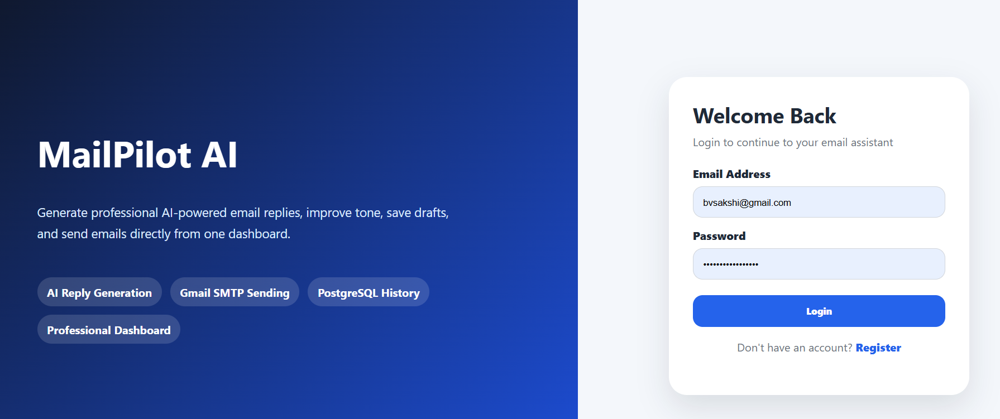
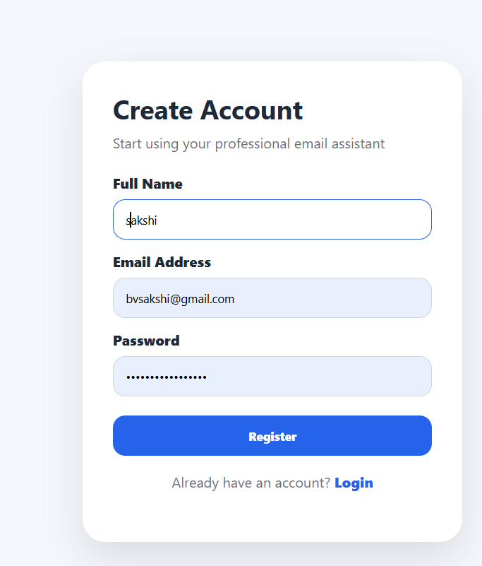
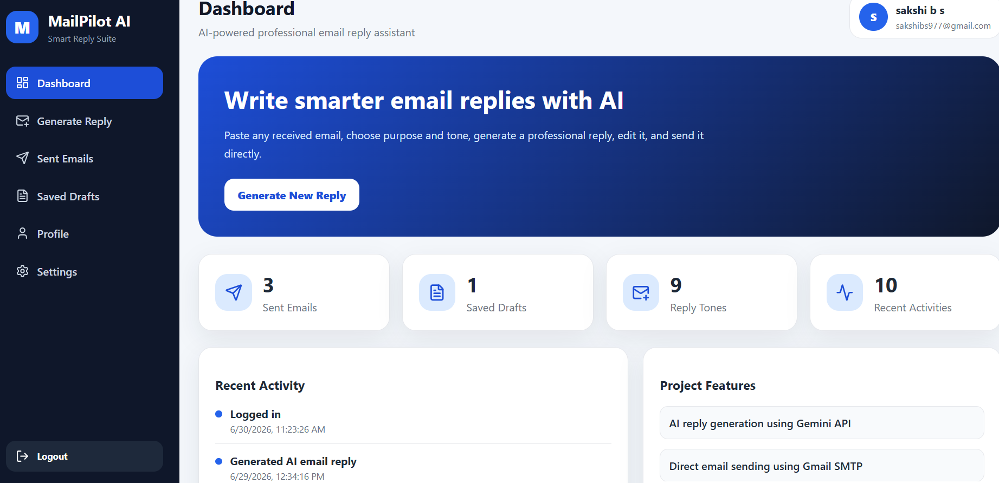
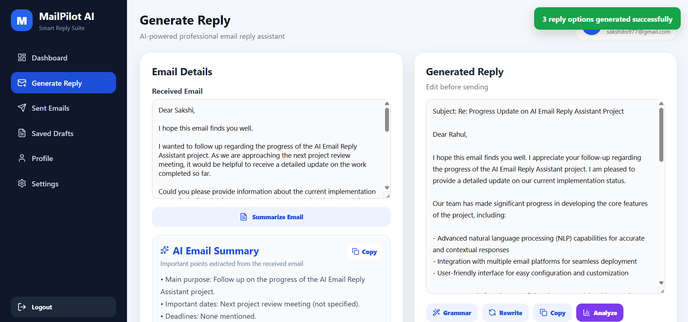
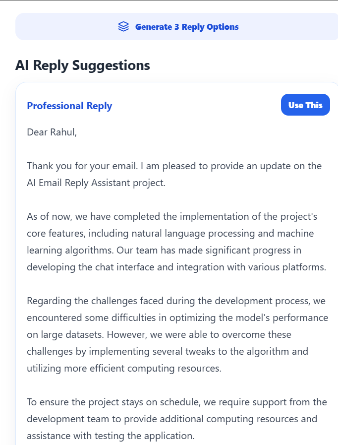
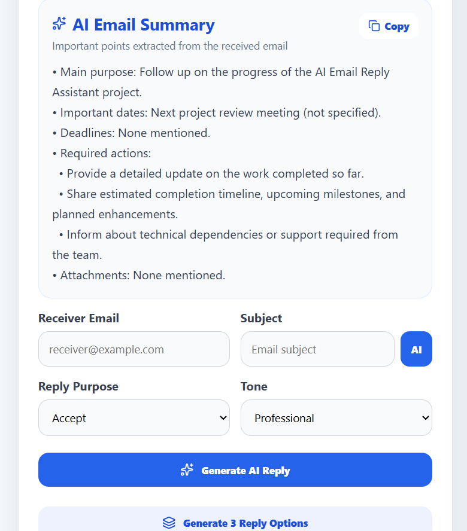
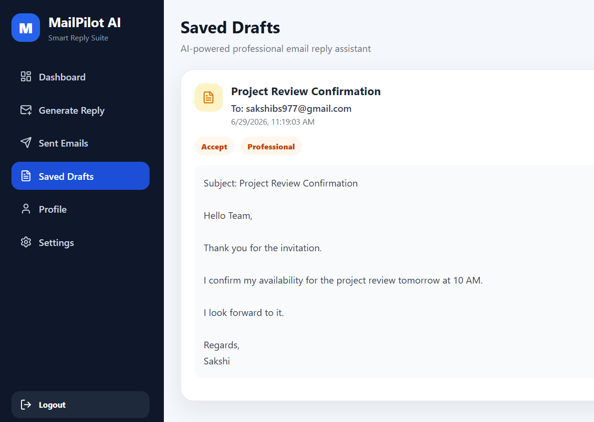
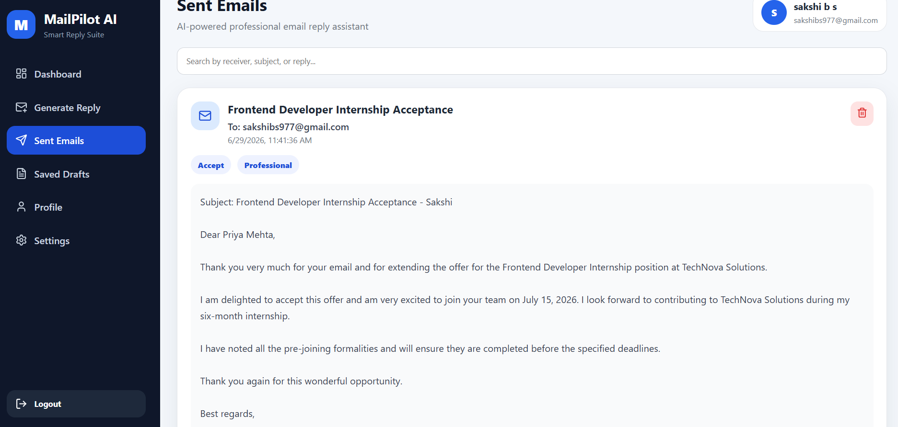
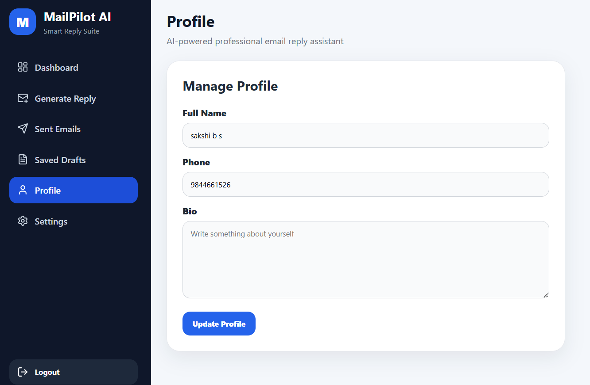
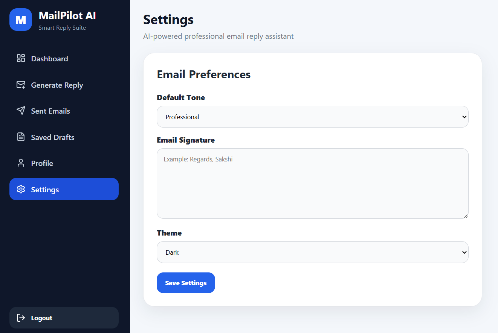

# AI Email Reply Assistant

An AI-powered full-stack web application that helps users generate professional email replies, summarize email content, manage drafts, and organize email communication through a clean and user-friendly interface.

---

## Features

- AI-powered email reply generation
- Multiple reply tone options
- Email summarization
- Draft email management
- Sent email history
- User login and registration
- JWT-based authentication
- Profile management
- Settings page
- Responsive user interface

---

## Tech Stack

### Frontend
- React.js
- CSS3
- Axios
- React Router DOM

### Backend
- Node.js
- Express.js

### Database
- PostgreSQL

### AI Integration
- Groq API

### Authentication
- JSON Web Token

---

## Screenshots

### Login Page


### Registration Page


### Dashboard


### AI Reply Generator


### Generated Reply


### Email Summarizer


### Draft Email


### Saved Drafts


### Sent Emails


### User Profile


### Settings


---

## Project Structure

```text
AI-Email-Reply-Assistant
│
├── frontend/        # React frontend application
├── backend/         # Node.js and Express backend API
├── README.md
└── .gitignore
```

---

## Installation

### Clone the Repository

```bash
git clone https://github.com/sakshi983-gf/ai-email-reply-assistant.git
```

---

### Backend Setup

```bash
cd backend
npm install
npm run dev
```

Create a `.env` file inside the `backend` folder:

```env
PORT=5000
DB_HOST=localhost
DB_PORT=5432
DB_NAME=mailpilot_ai
DB_USER=postgres
DB_PASSWORD=your_password
JWT_SECRET=your_secret_key
GROQ_API_KEY=your_groq_api_key
```

---

### Frontend Setup

Open a new terminal:

```bash
cd frontend
npm install
npm run dev
```

---

## Future Enhancements

- Gmail API integration
- Outlook integration
- Email scheduling
- Voice-to-email support
- Multi-language email replies
- AI-powered spam detection
- Dark mode
- Email analytics dashboard

---

## Author

**Sakshi B S**

GitHub: https://github.com/sakshi983-gf  
LinkedIn: https://www.linkedin.com/in/sakshi-b-s-050093290