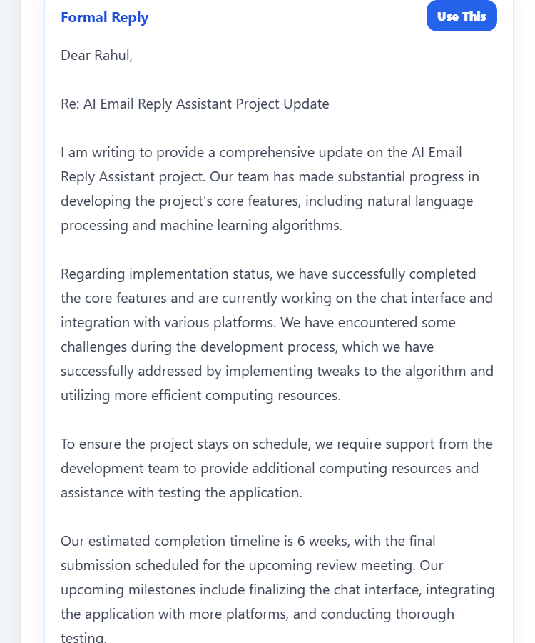
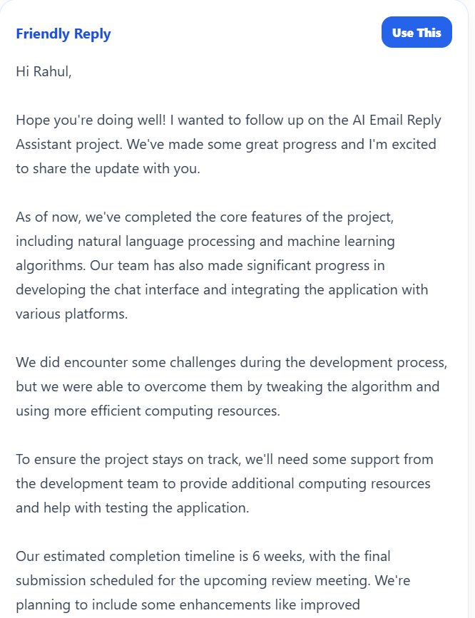

# AI Email Reply Assistant

An AI-powered full-stack web application that helps users generate professional email replies using Large Language Models (LLMs). The application enables users to create context-aware responses, summarize emails, manage drafts, and organize email communication through a clean and intuitive interface.

---

## Features

- 🤖 AI-powered email reply generation
- ✍️ Multiple reply tone options (Professional, Friendly, Formal, Casual)
- 📄 Email summarization
- 📧 Draft management
- 📤 Sent email history
- 👤 User authentication (Login & Registration)
- 🔒 Secure JWT authentication
- ⚙️ User profile and settings management
- 📱 Responsive user interface

---

## Tech Stack

### Frontend
- React.js
- CSS3
- Axios
- React Router DOM

### Backend
- Node.js
- Express.js

### Database
- PostgreSQL

### AI Integration
- Groq API (Llama Model)

### Authentication
- JSON Web Token (JWT)

### Version Control
- Git & GitHub

---

# Screenshots

## Login


---

## Registration


---

## Dashboard


---

## AI Reply Generator


---

## Generated Reply Example 1


---

## Generated Reply Example 2



---

## Generated Reply Example 3



---

## Email Summarization


---

## Draft Email


---

## Saved Drafts


---

## Sent Emails


---

## User Profile


---

## Settings


---

# Project Structure

```text
AI-Email-Reply-Assistant
│
├── frontend
│   ├── src
│   ├── public
│   └── package.json
│
├── backend
│   ├── config
│   ├── controllers
│   ├── middleware
│   ├── routes
│   ├── services
│   ├── database
│   ├── utils
│   ├── uploads
│   ├── server.js
│   └── package.json
│
├── assets
│   ├── login.png
│   ├── register.png
│   ├── dashboard.png
│   ├── reply-generator.png
│   ├── reply1.png
│   ├── reply2.png
│   ├── reply3.png
│   ├── summarize.png
│   ├── draft.png
│   ├── drafts.png
│   ├── sentemail.png
│   ├── profile.png
│   └── settings.png
│
├── README.md
└── .gitignore
```

---

# Installation

## Clone Repository

```bash
git clone https://github.com/sakshi983-gf/ai-email-reply-assistant.git
```

---

## Backend Setup

```bash
cd backend
npm install
```

Create a `.env` file:

```env
PORT=5000

DB_HOST=localhost
DB_PORT=5432
DB_NAME=mailpilot_ai
DB_USER=postgres
DB_PASSWORD=your_password

JWT_SECRET=your_secret

GROQ_API_KEY=your_api_key
```

Start the backend server:

```bash
npm run dev
```

---

## Frontend Setup

```bash
cd frontend
npm install
npm run dev
```

---

# Future Enhancements

- Gmail API integration
- Outlook integration
- Email scheduling
- AI-powered spam detection
- Smart attachment suggestions
- Voice-to-email
- Multi-language support
- Dark mode
- AI writing assistant
- Email analytics

---

# Author

**Sakshi B S**

**GitHub**
https://github.com/sakshi983-gf

**LinkedIn**
https://www.linkedin.com/in/sakshi-b-s-050093290

---

# License

This project is licensed under the MIT License.
